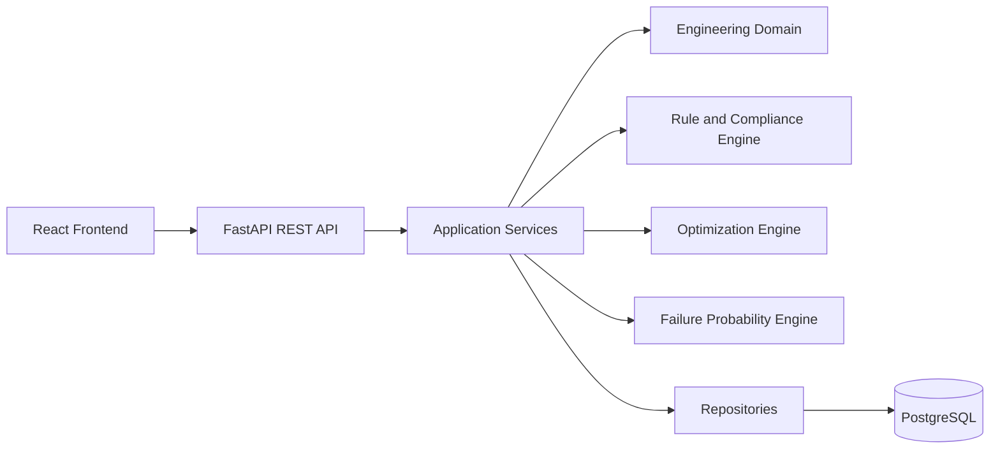

# System Architecture

## Layer responsibilities

### Frontend
User workflows, validation feedback, result visualization, dashboards.

### API
Authentication, authorization, request/response contracts, error mapping.

### Application
Use-case orchestration. No engineering equations should be embedded here.

### Domain
Pure calculations and engineering decisions. Domain modules should be testable
without HTTP or database access.

### Infrastructure
SQLAlchemy, PostgreSQL, file export, migration, Docker, external adapters.
